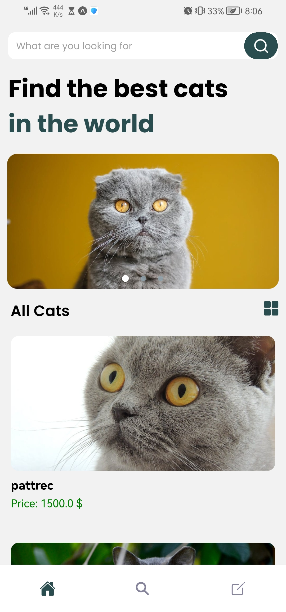

# CatsApp
this project create with expo and backend node.js 
#contain
.list of card cat
.add card cat
.remove card cat
.edit card cat
.search to search cats like name or price or Breed
#Install
to run this app
1) git clone from github
2) open in vscode or any  favorite IDE
3) write in terminal npm install
4) and write in terminal npm install  expo
5) npx expo start
6) "!important" write expo upgrade or any error
7) then write expo start

(https://drive.google.com/file/d/1FJJdpP88QlbCYrCASIo6yyIbKmxJKHF9/view?usp=drive_link)][(https://drive.google.com/file/d/1Fd7fj9Sm7qAZTGRFZu0G7bxyl828l1MS/view?autoplay=1)]

|  |  |
|:----------------------:|:----------------------:|
|      Home Page    |      Details Page     |

 |

